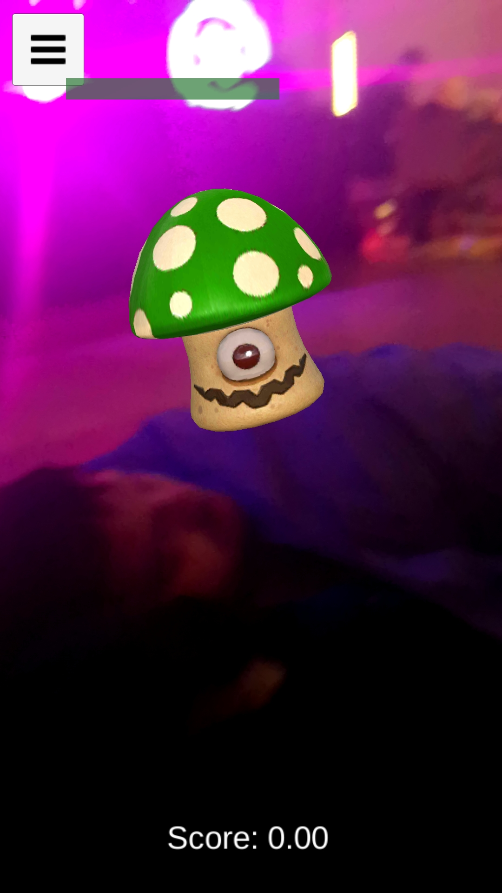
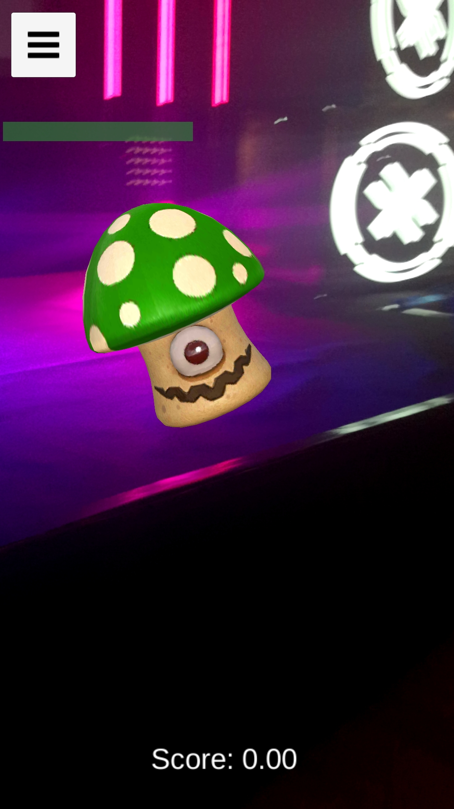
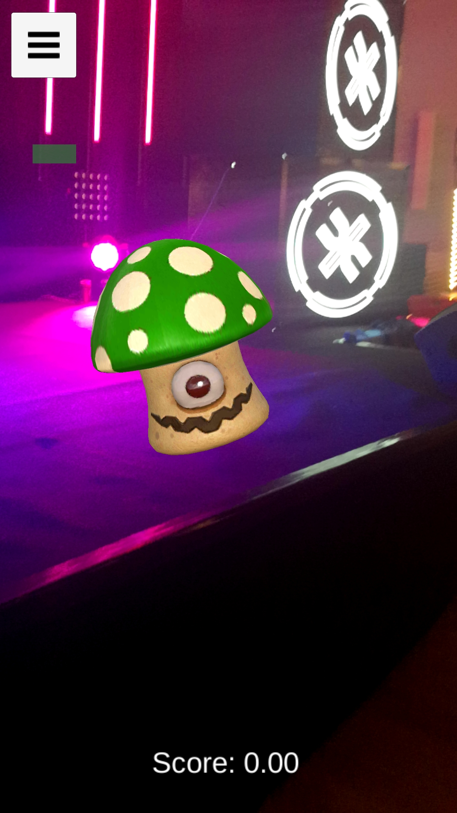
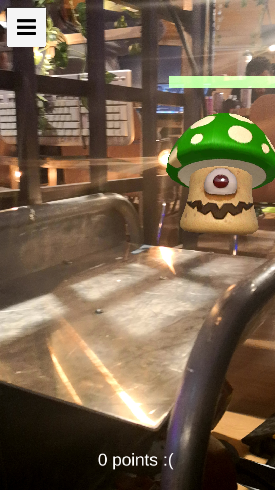

# hunction

Submission for Junction 2018 AI/Big Data track

Augmented reality app to be played in supermarkets to encourage parent-children collaboration and gain customer loyalty for a chain (supermarket, etc)

### About

We aimed to create a game for children to play while their parents are shopping. Not only would it be an opportunity for them to play together, but also encourage its use by offering sales or discounts based on one's ability in the game and thus strengthening the loyalty of customers. 

We used Unity for the Application.  The app offers an Augmented Reality experience in which you can visualize and fight against monsters. When a monster is defeated some points are added to the users' score. The score can be exchanged for discounts or other advantages. 

The backend is comprised of Flask and SQLAlchemy. The API is in charge of handling the interaction between Cisco's API and the application. The former provides the user's location inside the supermarket using the WiFi beacons. Once the location data is in Unity, we project the real-life coordinates to the augmented reality world. 

Unfortunately, the refresh rate was not fast enough for it to be used to track the movement of the player in the game in real time, therefore, we came up with a slightly different approach.

Instead of tracking the users' location in real time, we wait until the Cisco's API notifies us when the player is less than 2 meters away from the monster.

The last component of this project, the web, allows supermarket managers to choose the monster's location. This feature allows placing them at locations which suit the manager's interests such as attracting costumers to products.  

### Authors

* [JnxF](https://github.com/JnxF)
* [marcbenedi](https://github.com/marcbenedi)
* [david-campos](https://github.com/david-campos)
* [mbdavid2](https://github.com/mbdavid2)

### Used technologies

* Unity (C#)
* Flask (SQLAlchemy)
* Cisco Meraki (Scan API)

### Credit

* [Amusedart (Monster model and animations)](https://assetstore.unity.com/packages/3d/characters/creatures/fantasy-mushroom-mon-115406)

### Images

